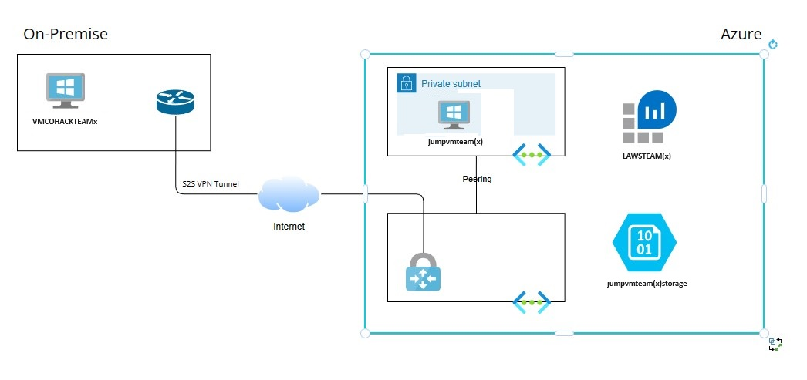

# Azure Monitoring MiniHack

## Overview

This challenge based Azure Monitoring Hackathon is intended to teach how to monitor Azure workloads.
During the mini Open Hack you will be working with Azure Monitor, Log Analytics and for the optional part with Azure arc.

## Goals

1. Build attendees technical skills on Monitoring workloads in Azure
2. Understand what Monitoring Tools are available in Azure and how to implement them.  

## Provided Setup

Attendees will get access to an Azure Subscription where a prebuild deployment is ready.  This includes some a VM, a Storage Account, a Log Analytics Workspace and some networking resources.

## Useful References

- [Diagnostic Settings in Azure Monitor](https://learn.microsoft.com/en-us/azure/azure-monitor/essentials/diagnostic-settings?tabs=portal)
- [Collect events and performance counters](https://learn.microsoft.com/th-th/azure/azure-monitor/agents/data-collection-rule-azure-monitor-agent?tabs=portal)
- [Connect hybrid machines with Azure Arc-enabled servers](https://learn.microsoft.com/en-us/azure/azure-arc/servers/learn/quick-enable-hybrid-vm)
- [Monitor a hybrid machine with VM insights](https://learn.microsoft.com/en-us/azure/azure-arc/servers/learn/tutorial-enable-vm-insights)

## Description

- Azure Credentials: The credentials will be handed out during the hack opening session.
- Resource Group: a resource group has been created where you will have a contributor role assigned to you. (Please do not install new resources, only change configuration)
- Log Analytics Workspace: This has already been pre-created to save some time. When configuring monitoring settings, it might take a few minutes before data will appear.
- Storage Account with Blob Container: Blob container has been created. Configure Diagnostic settings to send Logs and Metrics to your Log Analytics workspace.
- Azure virtual machine: This azure virtual machine needs to be configured so it will send monitoring data to the log analytics workspace. In the optional part, you can also use this machine as a jump vm to connect to the on-premises virtual machine.
- On-Premises virtual machine: This on-premises virtual machine needs to be configured with the new Azure monitor agent so it can also send the monitoring data to the log analytics workspace. (Optional challenge)

## Success Criteria

### Log Analytics Challenges

1. Configure diagnostic settings for BLOB in storage account.
2. Connect Azure VM to Log Analytics workspace.
3. Configure capture successful login/logout security events on Azure VM to Log Analytics workspace
4. Show Count Heartbeats with KQL Query
5. Show Security events with KQL Query

### Optional Challenges

1. Connect the on-premises vm to the Log Analytics Workspace with the new Azure Monitor Agent
        Tip: Azure arc
2. Get the "Security Events" from the on-premises azure vm guest os.
3. Create Notification Alert on Unsuccessful login on Azure VM
